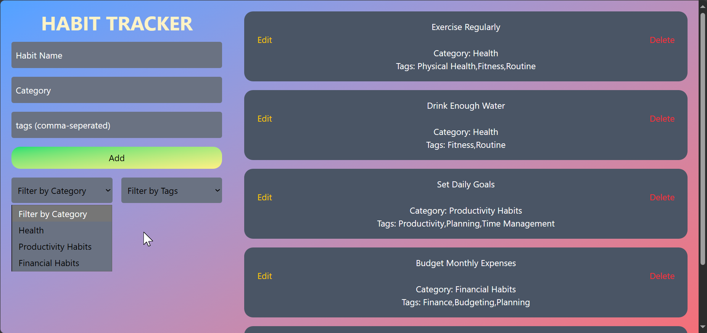

### About Habit Tracker App

The Habit Tracker App is a simple and intuitive tool designed to help you build and maintain positive habits. Key features include:

- **Habit Management**: Add and organize habits by name and category.
- **Tagging System**: Use tags for easy classification and filtering.
- **Filter Options**: Quickly find habits by tags and categories.
- **Edit and Delete**: Modify or remove habits as needed.

Start tracking your habits today and enhance your productivity!

### Dashboard

